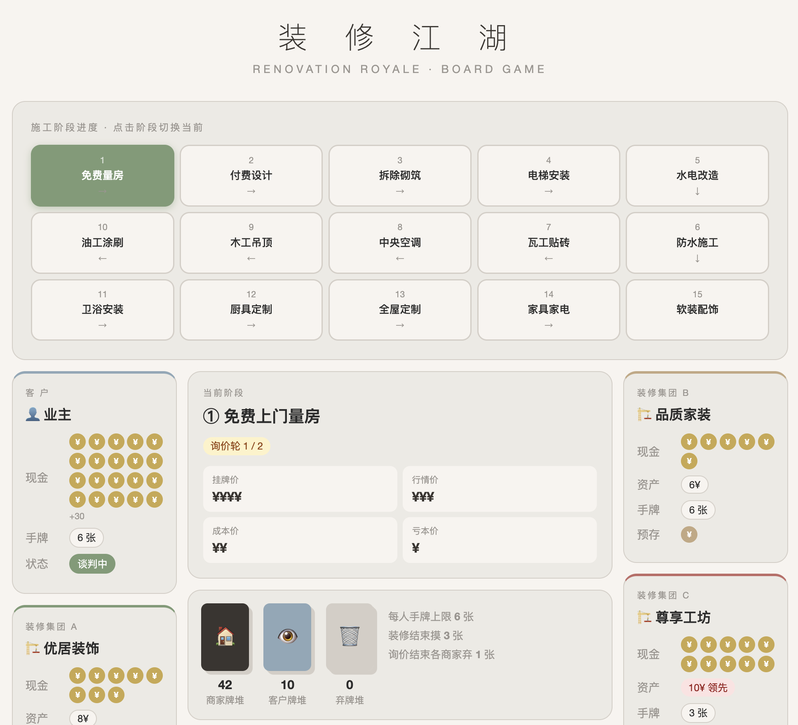
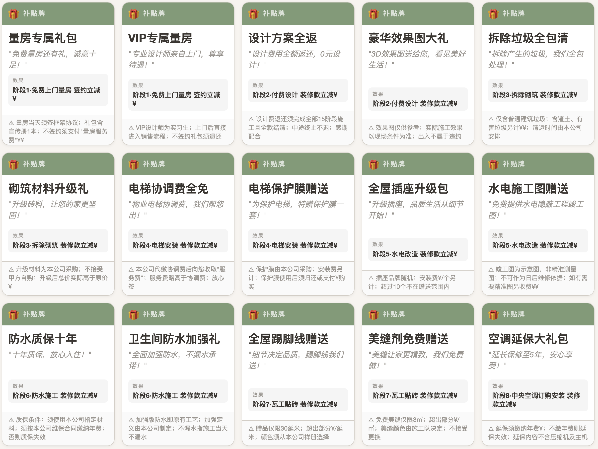
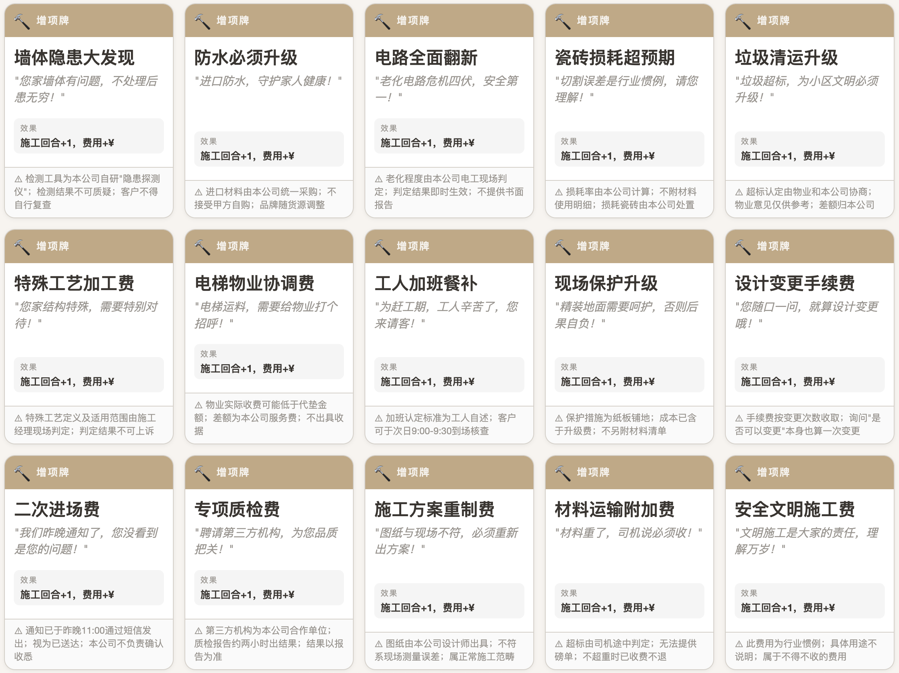
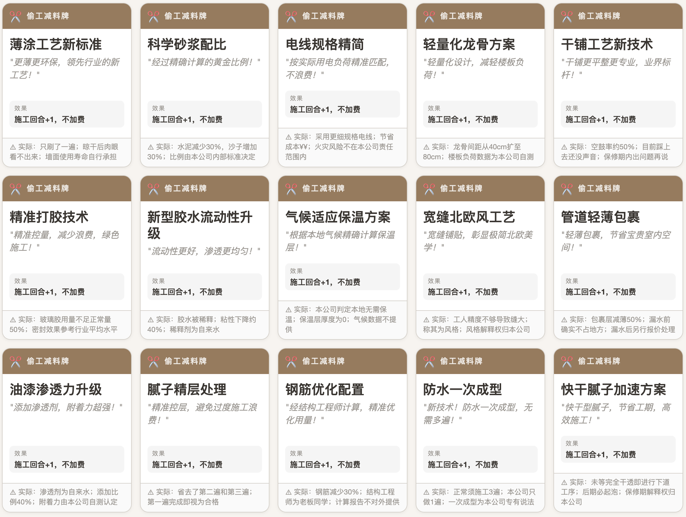
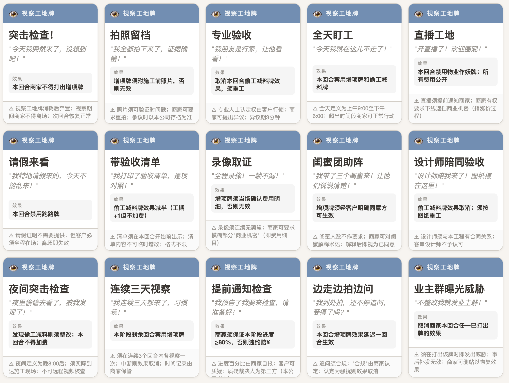

# 装修江湖：一个卡牌游戏

> "装修完，人也老了。" —— 每一个经历过装修的中国家庭

---

## 这个游戏揭示了什么

装修是一门玄学，也是一场博弈。

客户想要便宜、靠谱、不被坑；商家想要多收钱、少干活、最好还能预收款跑路。这对矛盾天生对立——但又彼此依存。商家太狠，客户装不完，行业萎缩，商家也完蛋；商家太老实，挣不着钱，也完蛋。

这就是装修行业的核心悖论：**一个人人都想赢、却很容易一起输的囚徒困境。**

这个游戏把这个悖论搬上了桌面，让你亲身体验：信息不对称有多可怕，预付款有多危险，增项有多烦，以及——为什么你明知道对方在画大饼，还是忍不住签了合同。

---

## 游戏概况

4人游戏：**1名客户** + **3+家装修集团**。

客户手持 **50¥**（每枚硬币代表 1¥），目标是用这笔钱走完装修的 15 个阶段，住进满意的新家。

三家装修集团各怀鬼胎，目标却出人意料地"向善"——

- **若客户顺利完成装修**：现金流最多的商家获胜。（皆大欢喜结局：客户住上了房子，商家赚到了钱。谁做了更多的生意，谁才是真正的赢家。）
- **若客户装修失败**：资产最多的商家获胜。（坑爹结局：客户烂尾，行业萎缩，大家一起在废墟里比烂。）

商家可以选择好好做生意，也可以选择——你懂的。

---

## 装修的 15 个阶段

游戏按以下顺序推进，每个阶段是一个大轮：

1. 免费上门量房
2. 付费设计
3. 拆除砌筑
4. 电梯安装
5. 水电改造
6. 防水施工
7. 瓦工贴砖
8. 中央空调订购安装
9. 木工吊顶
10. 油工找平涂刷
11. 卫浴订购安装
12. 厨具定制安装
13. 全屋定制柜安装
14. 家具家电订购安装
15. 软装配饰安装

每一个阶段，客户都要重新选择一家商家，重新被报价，重新被坑——或者，重新感受到"这次遇上良心商家了"的短暂幻觉。有时候，客户就是想多花点钱，把事情都交给一个商家，花钱买太平。但商家只想赚得更多————商家卷款跑路了。

---

## 价格体系

每个项目有四档价格：

| 价格 | 含义 |
|------|------|
| ¥ | 赔本赚吆喝（你以为是馅饼，其实是陷阱） |
| ¥¥ | 商家成本价（不亏本的底线） |
| ¥¥¥ | 市场标准行情价（公道价） |
| ¥¥¥¥ | 商家挂牌价（默认开价，你不砍价就是这个） |

商家每回合都要支付 ¥ 运营成本。施工时每个回合再额外支出 ¥。所以商家也不是一点压力没有——但他们的压力，跟客户的担惊受怕比起来，不是一个量级。

---

## 每轮流程

### 第一阶段：询价轮（共两轮）

三家商家轮流出牌、游说。他们可以打出优惠牌，更可以口头吹嘘手里的牌——但不展示。换句话说，"我这里有内部优惠"这句话，你永远不知道是真是假。预存装修款获得折扣，你看中折扣，商家看中你的本金。

客户可以随时打出手中的牌，也可以随时拍板选择任何一家。

两轮谈判后，**客户必须选定一家商家并当场付款**，然后装修开始，毕竟，谈得越久，客户的耐心就剩得越少。

> 友情提示：行动顺序每轮由资产最多的商家决定，他可以选择让穷鬼先说话，也可以让穷鬼最后说话。权力的味道。

### 第二阶段：装修轮

施工商家开始干活，每轮支付施工成本 ¥。其他商家按兵不动，但照样要支付运营成本 ¥——毕竟，没活干也要养人。

施工期间，各方都可以出牌搞事情。

装修结束后，所有商家摸 3 张牌，弃至手牌上限 6 张，进入下一阶段。

---

## 牌组

### 商家牌

**补贴牌**
"跟我签这单，后面装空调给你打折！"承诺在未来某个阶段让利 ¥。
*当然，如果他后来跑路了，优惠自动作废。这不，优惠只是一张空头支票。*

**增项牌**（施工中可用）
"师傅说要多做一道工序，这是为了您的房子好。"施工多一个回合，工钱加 ¥¥。
*这是中国装修最经典的剧目。客户视察工地可以防止此牌打出。*

**预存款牌**（询价中可用）
"您现在预付几期，总价给您打个折。"客户以优惠总价，提前交付多个阶段的款项。
*等等，把钱都压在一家公司手里……这难道不是在给跑路牌蓄力吗？*

**跑路牌**
"非常抱歉，由于市场环境恶化，本公司资金链断裂，即日起停止施工。"
预存款全部归商家所有，所有未兑现的优惠承诺作废，装修重新进入谈价阶段。
*注意：跑路的商家可以继续参与下一轮谈判。因为在现实中，他换个马甲照样在干。*

**偷工减料牌**（施工中可用）
施工工期 +1，但不收额外装修款。
*免费的延期？代价是什么？——代价是所有商家（包括其他没接活的）这多出来的一轮照常交运营成本。大家一起耗，等等看谁先撑不住。*

**物业作妖牌**（所有商家可用）
打出时商家支付 ¥；随后客户必须支付 ¥ 搞定物业，否则施工受阻。
*"垃圾清运费、扬尘治理费、电梯使用费……" 物业的花样，比装修公司还多。*

**今天优惠明天涨价牌**
报价降至 ¥¥，限今天签单。
*"这是内部价，我私下给您的，您千万别说出去。" 这句话，他今天说了八遍。*

**超低价诱惑牌**
报价直接给到 ¥¥ 成本价。
*谁能抗拒？没有人能抗拒。但请记住：商家亏本做的生意，总要从别的地方找回来。*

**平平无奇的促销牌**
报价 -¥。
*朴实无华。也许这才是最值得信任的商家。也许。*

---

### 客户牌

**视察工地**（5张）
打出后，商家本轮不得打出增项牌。
*现实依据：你得请假，打车，顶着烈日去工地盯着工人，就为了防止他们把你的水管埋歪了。装修客户的时间，比想象中值钱得多。*

**查阅小红书并砍一刀**（5张）
所有商家本轮报价 -1¥，最先同意降价的商家可优先成交。
*"我在网上查过了，这个价格不对。" 这句话，是客户对抗信息不对称的唯一武器——尽管小红书上的帖子，有一半是商家自己发的。*

---

## 结语

装修是一场持久战，也是一场心理战。商家的信息优势、客户的资金压力、以及那几张随时可能打出的"跑路牌"，共同构成了中国装修市场的真实生态。

这个游戏没有绝对的坏人——只有在有限资源下做出选择的人。

当然，有些选择，确实比另一些更让人讨厌。